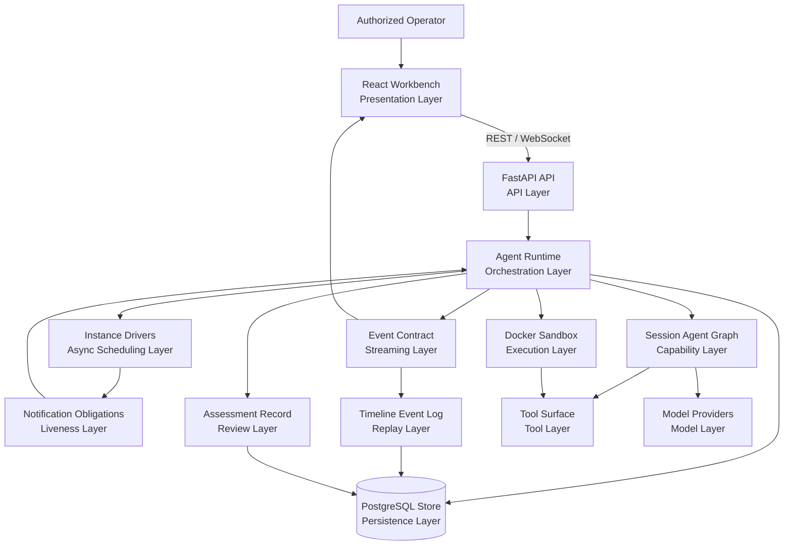
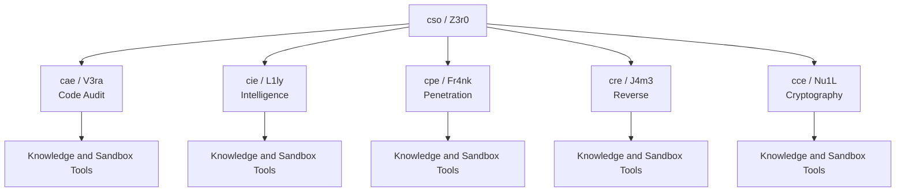
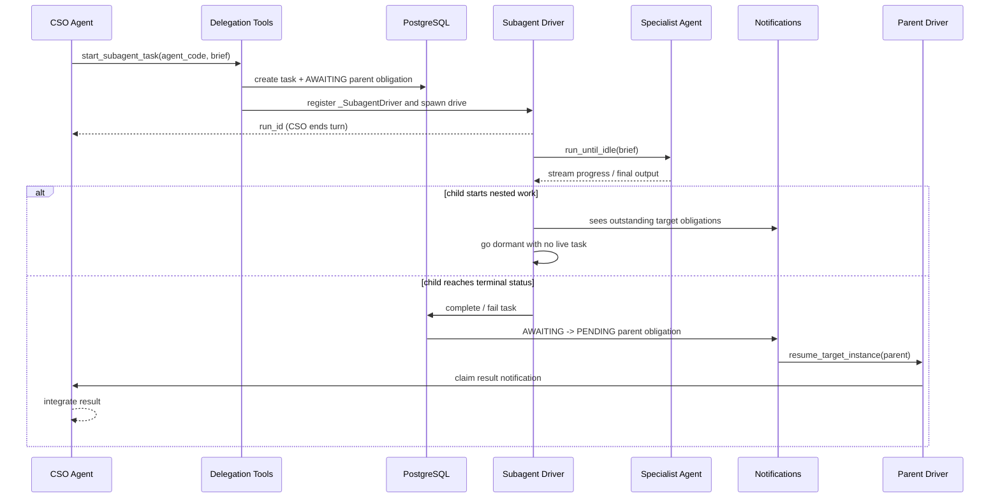
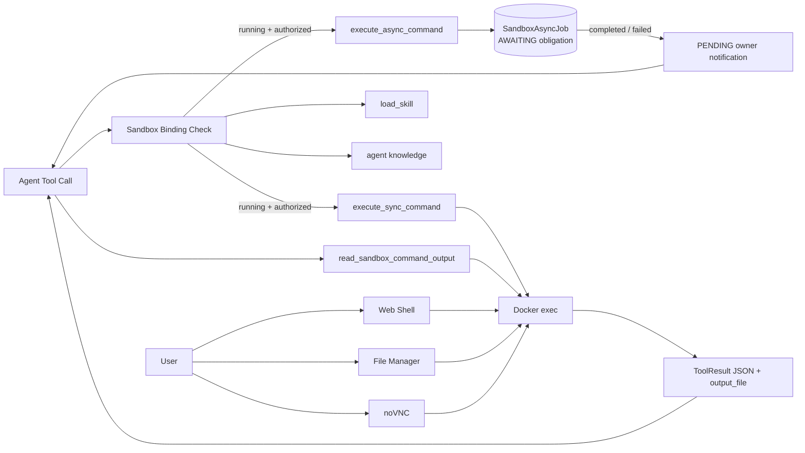

<p align="center">
  
</p>

<p align="center">
  <strong>English</strong> ·
  <a href="README_zh.md">中文</a>
</p>

<p align="center">
  <a href="#architecture">Architecture</a> ·
  <a href="#agent-team">Agent Team</a> ·
  <a href="#runtime-model">Runtime Model</a> ·
  <a href="#deployment">Deployment</a> ·
  <a href="Quickstart.md">Quickstart</a>
</p>

---

> :warning: **Legal Notice**
>
> **This project may be used only within a lawful and explicitly authorized scope for security testing, assessment, and research. Any unauthorized, unlawful, or harmful use is strictly prohibited. The author assumes no responsibility for any consequences, losses, damages, legal liabilities, or unlawful acts caused by users.**
>
> This project is provided only for authorized security assessment, code auditing, internal review, and controlled research. It does not grant permission to test, access, scan, or affect any third-party system, network, service, account, or data. Users are solely responsible for obtaining and preserving authorization, defining scope, and complying with applicable laws, contracts, and authorization boundaries.

Z3r0 is a controlled multi-agent workbench for authorized security assessment, code auditing, internal review, and controlled research. It coordinates a lead security agent, domain specialists, and Docker-backed execution surfaces so planning, evidence collection, validation, manual review, and reporting remain in a governed workflow.

## Design Principles

- **Authorized operation first**: Z3r0 is designed for approved internal assessments, code review, training, and controlled research environments.
- **Clear role boundaries**: a coordinator decomposes the task, while specialist agents handle intelligence, penetration validation, code audit, reverse engineering, and cryptographic review within defined scopes.
- **Traceable work**: sessions, tool calls, delegation jobs, and streamed events are persisted so reviews can be resumed and audited.
- **Controlled execution**: command execution, browser access, file management, and GUI tooling run through bound Docker sandboxes.
- **Model abstraction**: model access is kept behind runtime and role interfaces, using native OpenAI-compatible providers with configurable Chat Completions or Responses mode.

## Architecture



The system is organized into explicit layers: user-facing workbench, API boundary, runtime orchestration, resumable instance drivers, notification-backed liveness, session agent graph, controlled execution, model access, streaming event contract, durable timeline replay, and persisted assessment records. The backend owns authentication, session lifecycle, context projection, event normalization, delegation, sandbox binding, tool mounting, notification obligations, persistence, and history compaction. The frontend consumes stable REST and WebSocket contracts and does not depend on model SDK or provider internals.

## Agent Team

| Code | Name | Role | Responsibility |
| --- | --- | --- | --- |
| `cso` | Z3r0 | Chief Security Officer | Task decomposition, coordination, result integration |
| `cae` | V3ra | Chief Audit Engineer | Source code audit, dependency review, remediation verification |
| `cie` | L1ly | Chief Intelligence Engineer | Intelligence collection, asset mapping, relationship analysis |
| `cpe` | Fr4nk | Chief Penetration Engineer | Penetration testing, vulnerability validation, risk verification |
| `cre` | J4m3 | Chief Reverse Engineer | File, binary, firmware, and APK reverse engineering |
| `cce` | Nu1L | Chief Cryptography Engineer | Protocol review, key management, cryptographic implementation analysis |



Agent capabilities are assembled per session. `AgentRegistry` uses configuration, role specifications, knowledge generation, and the current sandbox binding to create a session-level agent graph. Command tools are mounted only when an authorized, running sandbox is bound to the session.

## Runtime Model

```mermaid
sequenceDiagram
  participant U as User
  participant W as WebSocket
  participant P as AgentSessionPool
  participant S as AgentSession
  participant TR as TaskRuntime
  participant A as Agent
  participant N as Notifications
  participant T as Timeline
  participant DB as PostgreSQL

  U->>W: send(text, agent_code, sandbox_id)
  W->>P: get_or_create(session_id)
  P->>S: start_turn(content)
  S->>S: launch main instance driver
  S->>TR: run_until_idle(initial_content)
  TR->>DB: load projected history
  TR->>A: Runner.run_streamed()
  A-->>TR: iter_interruptible_events()
  TR-->>S: normalized events
  S-->>W: publish to subscribers
  S->>T: stamp seq + upsert persistable event
  T->>DB: timeline event log
  TR->>DB: persist messages + metadata
  W-->>U: thinking / text / tool / done

  Note over TR,A: Notification arrives during turn
  TR->>TR: InterruptSignal (deferred if tool pending)
  TR->>DB: flush_partial_context
  TR->>N: claim PENDING notification
  N-->>TR: notification prompt / user message
  TR->>TR: run notification turn
  S->>S: stop when no PENDING work; do not wait on AWAITING work
```

Key runtime boundaries:

- **Non-blocking instance drivers**: `AgentSession._drive` and `_SubagentDriver` run the optional initial turn, drain currently claimable notifications, then settle. Drivers stop while background work is still `AWAITING`; completion notifications relaunch the owning main or subagent instance when integration work is ready.
- **Interrupt-driven task execution**: `run_until_idle` manages the agent turn lifecycle; `iter_interruptible_events` races the SDK event stream against notification signals and raises `InterruptSignal` at safe points (after pending tool calls complete), modeled after CPU interrupt masking for atomicity.
- **Notification-backed liveness**: `AgentNotification` rows are the single source of truth for active work. `AWAITING` tracks running background obligations, `PENDING` wakes the owning agent, and `PROCESSING` marks a claimed notification turn.
- **Turn-terminal async commands**: `execute_async_command` dispatches a sandbox command, returns only `status` and `run_id`, and `AgentRegistry` ends the turn immediately via `tool_use_behavior`. The agent is resumed automatically when the command completes; there is no polling or list-wait loop.
- **Timeline event log**: live events are stamped with stable `seq` values and item keys in `TimelineLogWriter`; persistable events are upserted into the durable event log so replay reads the same wire events instead of reconstructing UI state from SDK messages.
- **Event normalization**: raw model and agent SDK events are converted into stable frontend events such as `thinking_delta`, `text_delta`, `tool_call`, `tool_result`, and `subagent_task`.
- **Session pool**: `AgentSessionPool` manages active sessions, notification recovery, interruption, cancellation, idle eviction, and tool-binding invalidation.
- **History projection**: `Z3r0Session` adds owner and nested-call metadata around SDK messages so each agent receives the right view of the shared conversation.
- **Context compaction**: when context approaches the model window, the runtime summarizes earlier projected history while preserving recent context and durable facts.

## Delegation Flow



Specialist agents run through resumable per-run `_SubagentDriver` instances. Starting a subagent creates the `AgentSubordinateTask` record and the parent `SUBAGENT_FINISHED` notification obligation in one database transaction, so the parent never observes a gap where the child is neither running nor pending integration. Each subagent driver uses the same `run_until_idle` executor as the main agent, streams nested events through the session event bus, and then settles into one of three states: relaunch if a claimable notification arrived during drain, go dormant if child work or async jobs are still outstanding, or complete/fail/cancel the task.

When a subagent completes or fails, the task update and parent obligation transition (`AWAITING` -> `PENDING`) commit together. `resume_target_instance` wakes the owning driver: main-agent targets route through `AgentSessionPool.resume_session`, while subagent targets relaunch their dormant `_SubagentDriver`. Canceled subagents resolve their obligation without waking the parent.

## Sandbox Tooling



The optional sandbox image can include a browser, noVNC, reverse engineering utilities, network assessment utilities, and related review tools. Synchronous commands return captured output metadata immediately. Asynchronous commands are deliberately turn-terminal: after dispatch, the agent stops and is resumed only after the job completes or fails, with terminal status, exit code, output size, and output file delivered through the owner notification. Agents read completed output with `read_sandbox_command_output`; they do not poll running jobs.

## Technical Characteristics

- **True async instance drivers**: main and subagent drivers drain ready turns and then stop; they do not block on background children or long sandbox commands. Completion notifications relaunch the owning instance when integration work is ready.
- **Interrupt-driven task runtime**: `run_until_idle` provides a unified execution loop for both main and sub-agents; `iter_interruptible_events` races the SDK event stream against notification signals, raising `InterruptSignal` with CPU-interrupt-style atomicity that defers preemption until pending tool calls complete.
- **Notification obligation scheduler**: subagent tasks and sandbox async jobs register `AWAITING` obligations atomically with their own records; terminal updates flip obligations to `PENDING`, `COMPLETED`, `FAILED`, or `CANCELED` so session liveness comes from one table.
- **Turn-terminal async command dispatch**: successful `execute_async_command` calls end the agent turn immediately through SDK tool-use behavior, preventing follow-up polling and making completion notification the only resume path.
- **Session-level agent graph**: role configuration, tools, knowledge, and subagents are bound dynamically per session.
- **Self-healing delegation drivers**: subagents can be canceled while live or dormant, stale running tasks are failed on backend restart, and relaunch budgets prevent hot loops when a driver cannot make progress.
- **Durable timeline replay**: the UI timeline persists stable event payloads with monotonic `seq` values and item keys, so refresh/replay uses the same event contract as live streaming.
- **Viewer-specific context projection**: agents share one persisted history while receiving scoped context views, reducing cross-agent leakage of private tool details.
- **Long-context compaction**: model-window-aware summaries preserve durable facts and recent state for long reviews.
- **Stable streaming contract**: the frontend is decoupled from SDK event details and consumes application-level event schemas.
- **Sandbox tool invalidation**: sandbox status changes invalidate tool bindings and clean up running subagent tasks or async commands.

## Repository Layout

```text
core/        Agent specs, runtime, task runtime, delegation, context, tools
service/     Domain services: agent, sandbox, users, work projects
router/      FastAPI route declarations
handler/     HTTP and WebSocket handlers
model/       SQLModel database models
schema/      Pydantic API contracts
web/         React workbench
sandbox/     Optional Docker sandbox image
.z3r0/       Runtime config, agent prompts, logs
```

## Deployment

For a step-by-step setup guide, see [Quickstart.md](Quickstart.md).

```bash
cp .z3r0/config.json.example .z3r0/config.json
# Review database, initial administrator, model provider, and sandbox settings.
docker compose -f docker-compose.prod.yml up -d --build
```

Open `http://127.0.0.1:8000`.

## Security Boundary

Z3r0 is intended only for authorized security assessment, code auditing, internal review, and research or training environments. The project does not authorize access to any third-party target and must not be used for unauthorized or unlawful activity. Sandbox containers, the Docker socket, terminal access, file management, and model credentials are high-privilege assets and should be used only in trusted, isolated environments.

Users must define and follow an explicit authorization scope before using any tool capability. The author is not responsible for any consequence, loss, damage, legal liability, or unlawful act caused by user activity.

## Acknowledgments

Thanks to the [Linux.do](https://linux.do/) website and its community for their support in project development and communication.

## License

This project is licensed under the [MIT License](LICENSE).
