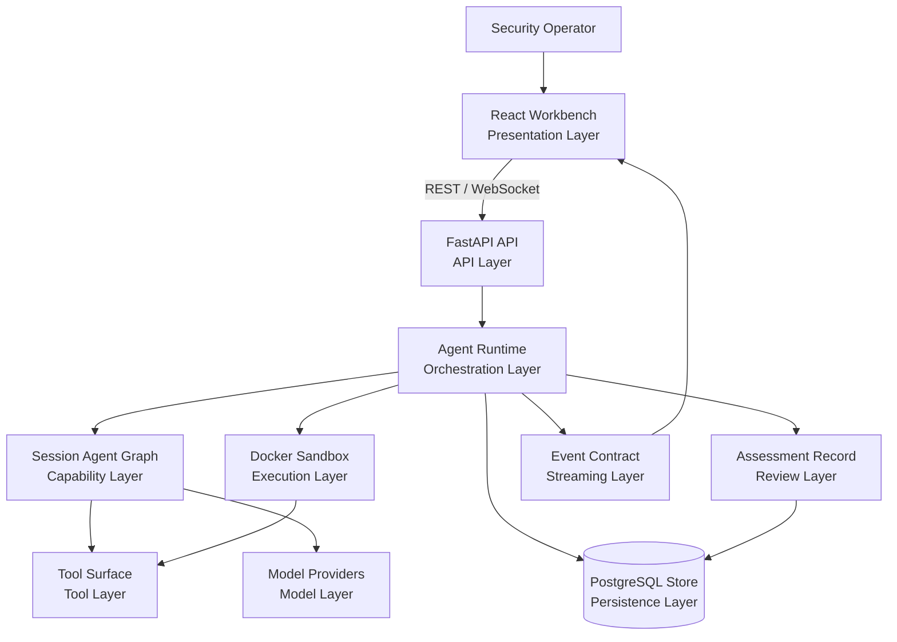
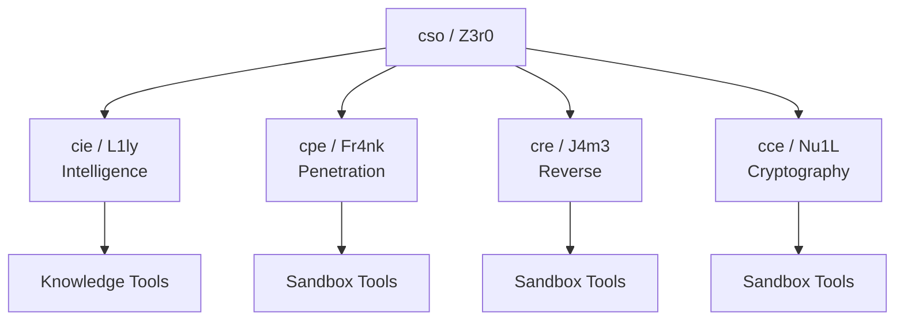
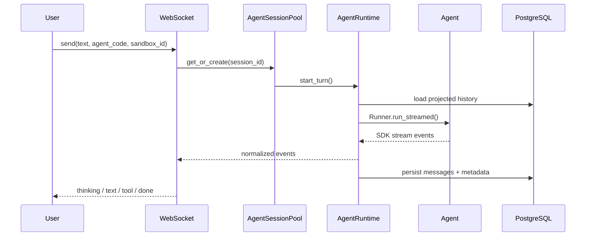
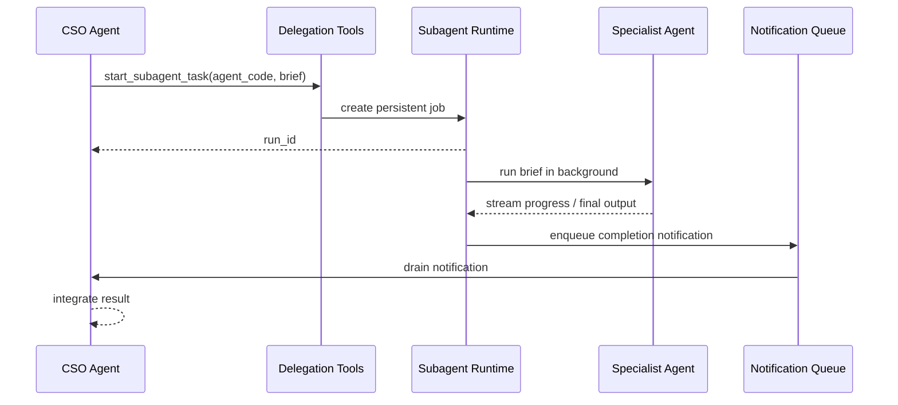
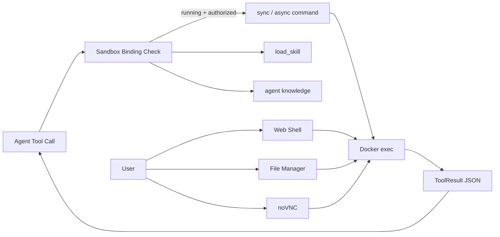

<p align="center">
  
</p>

<p align="center">
  <strong>English</strong> ·
  <a href="README_zh.md">中文</a>
</p>

<p align="center">
  <a href="#architecture">Architecture</a> ·
  <a href="#agent-team">Agent Team</a> ·
  <a href="#runtime-model">Runtime Model</a> ·
  <a href="#deployment">Deployment</a> ·
  <a href="Quickstart.md">Quickstart</a>
</p>

---

Z3r0 is a controlled multi-agent workbench for enterprise red team operations, authorized security assessments, code auditing, and security research. It coordinates a lead security agent, domain specialists, and Docker-backed execution surfaces so planning, evidence collection, validation, operator takeover, and review remain in one governed workflow.

## Design Principles

- **Authorized operation first**: Z3r0 is designed for approved internal assessments, adversary emulation, code review, and controlled research environments.
- **Clear role boundaries**: a coordinator decomposes the task, while specialist agents handle intelligence, penetration validation, reverse engineering, and cryptographic review within defined scopes.
- **Traceable work**: sessions, tool calls, delegation jobs, and streamed events are persisted so investigations can be resumed and reviewed.
- **Controlled execution**: command execution, browser access, file management, and GUI tooling run through bound Docker sandboxes.
- **Model abstraction**: model access is kept behind runtime and role interfaces, with support for LiteLLM and OpenAI-compatible providers.

## Architecture



The system is organized into explicit layers: operator-facing workbench, API boundary, runtime orchestration, session agent graph, controlled execution, model access, streaming event contract, and persisted assessment record. The backend owns authentication, session lifecycle, context projection, event normalization, delegation, sandbox binding, tool mounting, persistence, and history compaction. The frontend consumes stable application-level REST and WebSocket contracts and does not depend on model SDK or provider internals.

## Agent Team

| Code | Name | Role | Responsibility |
| --- | --- | --- | --- |
| `cso` | Z3r0 | Chief Security Officer | Task decomposition, coordination, result integration |
| `cie` | L1ly | Chief Intelligence Engineer | Intelligence collection, asset mapping, relationship analysis |
| `cpe` | Fr4nk | Chief Penetration Engineer | Penetration testing, vulnerability validation, risk verification |
| `cre` | J4m3 | Chief Reverse Engineer | File, binary, firmware, and APK reverse engineering |
| `cce` | Nu1L | Chief Cryptography Engineer | Protocol review, key management, cryptographic implementation analysis |



Agent capabilities are assembled per session. `AgentRegistry` uses configuration, role specifications, knowledge generation, and the current sandbox binding to create a session-level agent graph. Command tools are mounted only when an authorized, running sandbox is bound to the session.

## Runtime Model



Key runtime boundaries:

- **Event normalization**: raw model and agent SDK events are converted into stable frontend events such as `thinking_delta`, `text_delta`, `tool_call`, `tool_result`, and `subagent_task`.
- **Session pool**: `AgentSessionPool` manages active sessions, interruption, cancellation, idle eviction, and tool-binding invalidation.
- **History projection**: `Z3r0Session` adds owner and nested-call metadata around SDK messages so each agent receives the right view of the shared conversation.
- **Context compaction**: when context approaches the model window, the runtime summarizes earlier projected history while preserving recent context and durable facts.

## Delegation Flow



Specialist agents can run as persistent background jobs. Status, progress, results, and errors are stored in PostgreSQL and streamed to the frontend. When a delegated job reaches a terminal state, the coordinator receives a runtime notification and can integrate the result into the main assessment.

## Sandbox Tooling



The optional sandbox image includes a browser, noVNC, Ghidra, jadx, sqlmap, nmap, and related security tooling. Agents receive structured tool results; operators can open an interactive shell, GUI screen, and file manager for manual takeover, validation, and review.

## Technical Characteristics

- **Session-level agent graph**: role configuration, tools, knowledge, and subagents are bound dynamically per session.
- **Persistent delegation jobs**: subagents run in the background, can be canceled, can recover from stale runtime state, and notify the coordinator when finished.
- **Viewer-specific context projection**: agents share one persisted history while receiving scoped context views, reducing cross-agent leakage of private tool details.
- **Long-context compaction**: model-window-aware summaries preserve durable facts and recent state for long investigations.
- **Stable streaming contract**: the frontend is decoupled from SDK event details and consumes application-level event schemas.
- **Sandbox tool invalidation**: sandbox status changes invalidate tool bindings and clean up running subagent tasks or async commands.

## Repository Layout

```text
core/        Agent specs, runtime, delegation, context, tools
service/     Domain services: agent, sandbox, users, work projects
router/      FastAPI route declarations
handler/     HTTP and WebSocket handlers
model/       SQLModel database models
schema/      Pydantic API contracts
web/         React workbench
sandbox/     Optional Docker sandbox image
.z3r0/       Runtime config, agent prompts, logs
```

## Deployment

For a step-by-step setup guide, see [Quickstart.md](Quickstart.md).

```bash
cp .z3r0/config.json.example .z3r0/config.json
# Review database, initial administrator, model provider, and sandbox settings.
docker compose -f docker-compose.prod.yml up -d --build
```

Open `http://127.0.0.1:8000`.

## Security Boundary

Z3r0 is intended for authorized security testing, code auditing, red team exercises, and research or training environments. Sandbox containers, the Docker socket, terminal access, file management, and model credentials are high-privilege assets and should be used only in trusted, isolated environments.

## Acknowledgments

Thanks to the [Linux.do](https://linux.do/) website and its community for their support in project development and communication.

## License

This project is licensed under the [MIT License](LICENSE).
