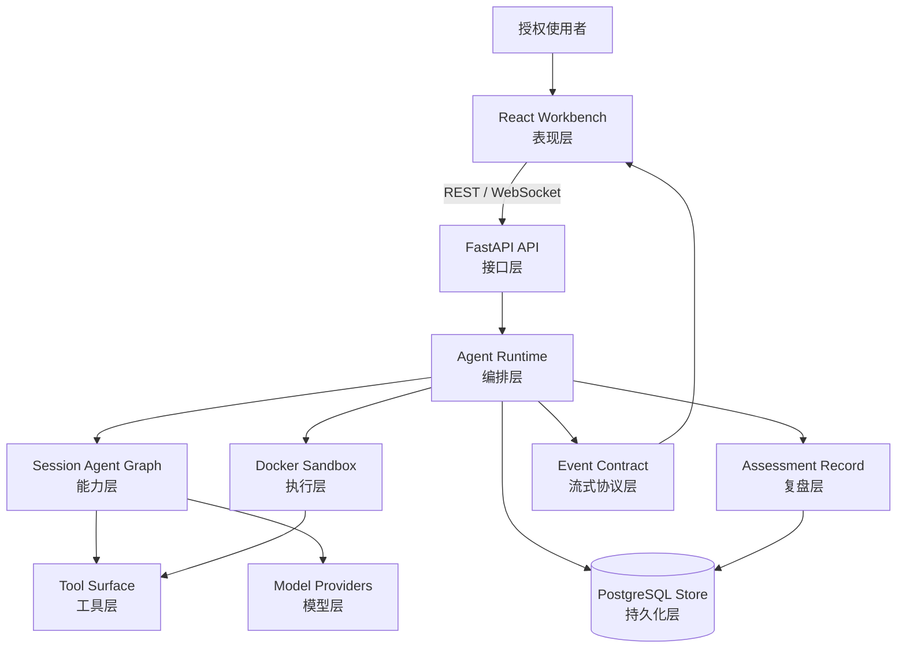
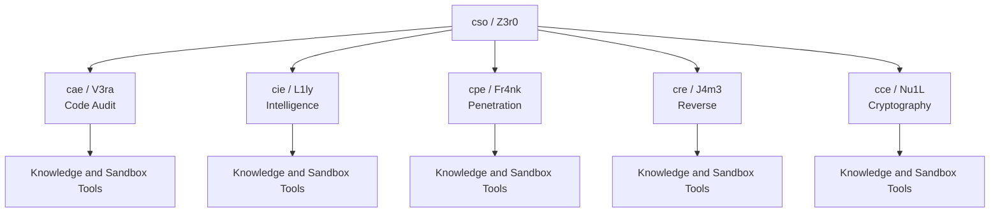
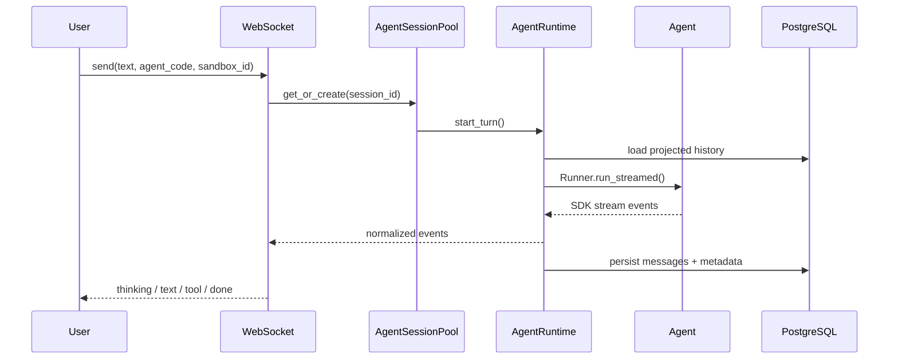
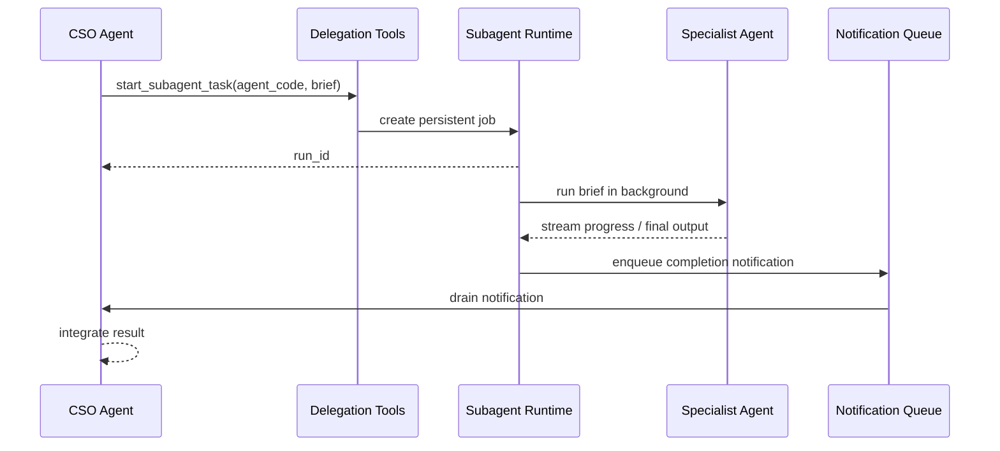
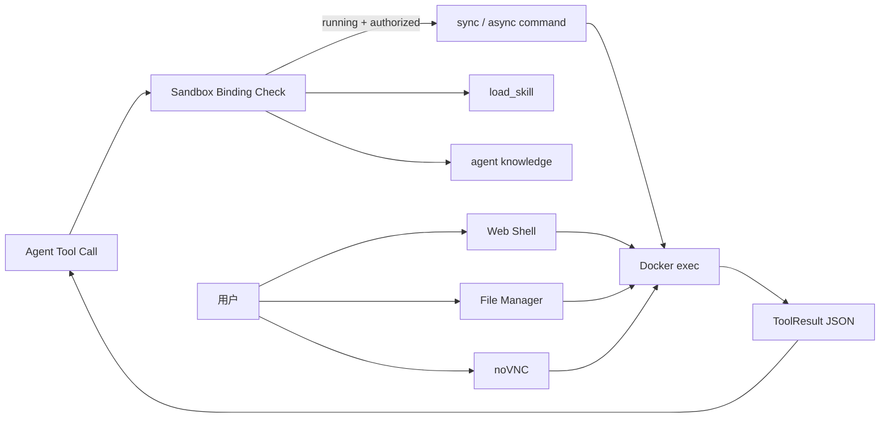

<p align="center">
  
</p>

<p align="center">
  <a href="README.md">English</a> ·
  <strong>中文</strong>
</p>

<p align="center">
  <a href="#总体架构">总体架构</a> ·
  <a href="#agent-编队">Agent 编队</a> ·
  <a href="#运行模型">运行模型</a> ·
  <a href="#部署运行">部署运行</a> ·
  <a href="Quickstart_zh.md">快速开始</a>
</p>

---

> :warning: **法律声明**
>
> **本项目仅限在合法且明确授权的范围内用于安全测试、评估与研究，严禁用于任何未授权、违法或有害用途。作者不对使用者造成的任何后果、损失、损害、法律责任或违法行为负责。**
>
> 本项目仅面向已授权的安全评估、代码审计、内部复核和受控研究场景。本项目本身不授予任何测试、访问、扫描或影响第三方系统、网络、服务、账号或数据的权限。使用者应自行取得并保存授权，明确使用范围，并遵守适用法律法规、合同约定和授权边界。

Z3r0 是一个面向授权安全评估、代码审计、内部复核和受控研究场景的多 Agent 工作台。平台以主控安全 Agent、专业 Agent 和 Docker 执行边界组织任务，使计划制定、证据收集、验证、人工复核和报告整理保持在受控工作流中。

## 设计原则

- **授权优先**：面向经过批准的内部评估、代码审计、培训和受控研究环境。
- **职责清晰**：主控 Agent 负责任务拆解和结果整合，专业 Agent 分别处理情报搜集、渗透验证、代码审计、逆向分析和密码学审查。
- **过程追踪**：会话、工具调用、委派任务和流式事件持久化存储，便于恢复、审计和复核。
- **执行受控**：命令执行、浏览器、文件管理和图形工具均通过绑定的 Docker 沙箱提供。
- **模型解耦**：模型访问收敛在运行时和角色接口之后，支持 LiteLLM 与 OpenAI 兼容模型服务。

## 总体架构



系统按明确层次组织：面向使用者的工作台、API 边界、运行时编排、会话级 Agent Graph、受控执行、模型访问、流式事件协议和持久化评估记录。后端负责认证、会话生命周期、上下文投影、事件归一化、任务委派、沙箱绑定、工具挂载、持久化和历史压缩；前端消费稳定的 REST 与 WebSocket 协议，不直接依赖模型 SDK 或模型服务商细节。

## Agent 编队

| Code | Name | Role | 主要职责 |
| --- | --- | --- | --- |
| `cso` | Z3r0 | Chief Security Officer | 任务拆解、团队协调、结果整合 |
| `cae` | V3ra | Chief Audit Engineer | 代码审计、依赖审查、修复复核 |
| `cie` | L1ly | Chief Intelligence Engineer | 情报收集、资产梳理、关系分析 |
| `cpe` | Fr4nk | Chief Penetration Engineer | 渗透测试、漏洞验证、风险确认 |
| `cre` | J4m3 | Chief Reverse Engineer | 文件、二进制、固件、APK 逆向 |
| `cce` | Nu1L | Chief Cryptography Engineer | 密码协议、密钥管理、实现审查 |



Agent 能力按会话动态装配。`AgentRegistry` 基于配置、角色规格、知识生成结果和当前沙箱绑定创建会话级 Agent Graph；只有当会话绑定了已授权且运行中的沙箱时，命令类工具才会挂载。

## 运行模型



关键运行边界：

- **事件归一化**：模型和 Agent SDK 的原始事件被转换为稳定的 `thinking_delta`、`text_delta`、`tool_call`、`tool_result`、`subagent_task` 等前端事件。
- **会话池**：`AgentSessionPool` 维护活跃会话，支持中断、取消、空闲回收和工具绑定失效。
- **历史投影**：`Z3r0Session` 在 SDK 消息外补充 owner、nested call 等元数据，使不同 Agent 获得适合自身角色的共享上下文视图。
- **上下文压缩**：当上下文接近模型窗口时，运行时会摘要更早的投影历史，同时保留近期上下文和关键事实。

## 委派链路



专业 Agent 可以作为持久化后台任务运行。任务状态、进度、结果和错误会写入 PostgreSQL 并实时推送到前端；当委派任务进入终态后，主控 Agent 会收到运行时通知，并将结果纳入主评估流程。

## 沙箱工具



可选沙箱镜像可包含浏览器、noVNC、逆向分析工具、网络评估工具和相关复核工具。Agent 接收结构化工具结果，使用者可打开交互式终端、图形界面和文件管理器，在授权范围内进行人工验证和复核。

## 技术特性

- **会话级 Agent Graph**：角色配置、工具、知识库和子 Agent 按会话状态动态绑定。
- **持久化委派任务**：子 Agent 后台运行、可取消、可从陈旧运行状态恢复，并在完成后通知主控 Agent。
- **多视角上下文投影**：不同 Agent 共享同一份持久化历史，但只接收符合自身角色的上下文视图，降低工具私有信息互相污染的风险。
- **长上下文压缩**：基于模型窗口生成摘要，保留长周期复核中的关键事实和近期状态。
- **稳定流式协议**：前端与模型 SDK 解耦，只消费应用级事件模型。
- **沙箱工具失效控制**：沙箱状态变化会触发工具绑定失效，并清理运行中的子任务或异步命令。

## 代码结构

```text
core/        Agent 规格、运行时、委派、上下文、工具
service/     业务服务：Agent、沙箱、用户、工作项目
router/      FastAPI 路由定义
handler/     HTTP/WebSocket 请求处理
model/       SQLModel 数据模型
schema/      Pydantic API 契约
web/         React 前端工作台
sandbox/     可选 Docker 沙箱镜像
.z3r0/       运行配置、Agent 角色提示词、日志
```

## 部署运行

完整部署步骤见 [Quickstart_zh.md](Quickstart_zh.md)。

```bash
cp .z3r0/config.json.example .z3r0/config.json
# 检查数据库、初始管理员、模型服务和沙箱相关配置
docker compose -f docker-compose.prod.yml up -d --build
```

访问 `http://127.0.0.1:8000`。

## 安全边界

Z3r0 仅面向合法授权的安全评估、代码审计、内部复核和研究教学场景。本项目不授权访问任何第三方目标，不得用于未授权或违法活动。沙箱容器、Docker socket、终端、文件管理器和模型密钥均属于高权限资产，应仅在可信、隔离的环境中使用。

使用者在调用任何工具能力前，应先明确并遵守授权范围。作者不对使用者行为造成的任何后果、损失、损害、法律责任或违法行为负责。

## 致谢

感谢[Linux.do](https://linux.do/)站点及其社区为项目开发和交流提供支持。

## License

本项目基于 [MIT License](LICENSE) 开源。
